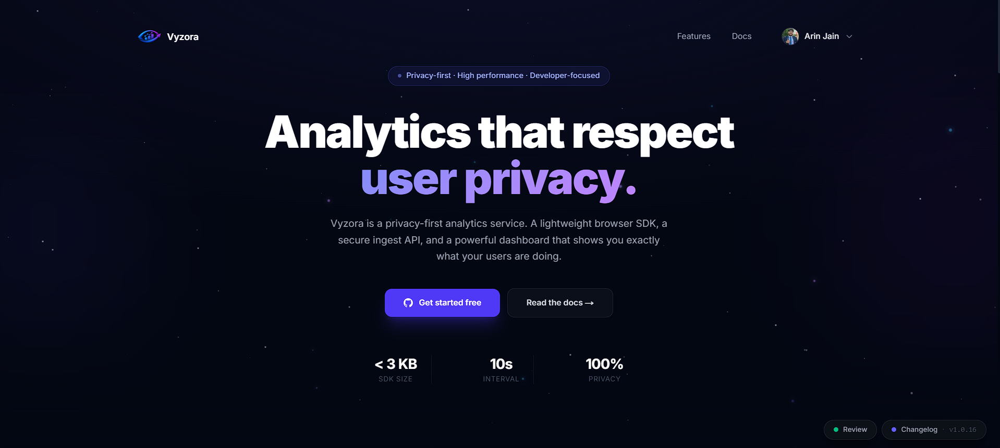
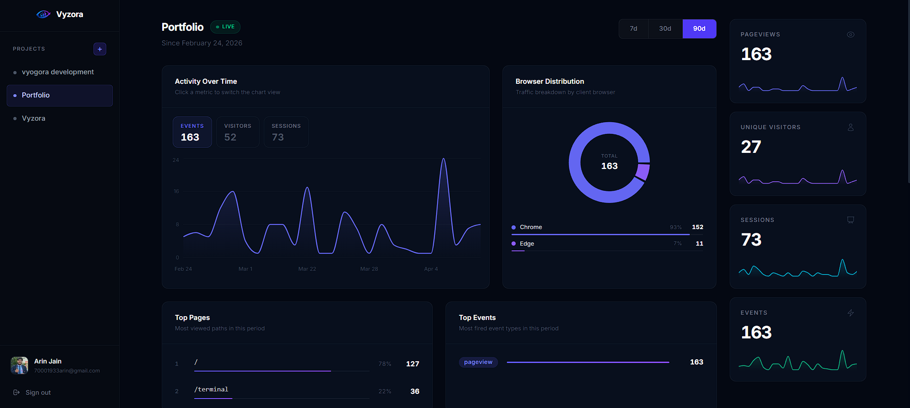
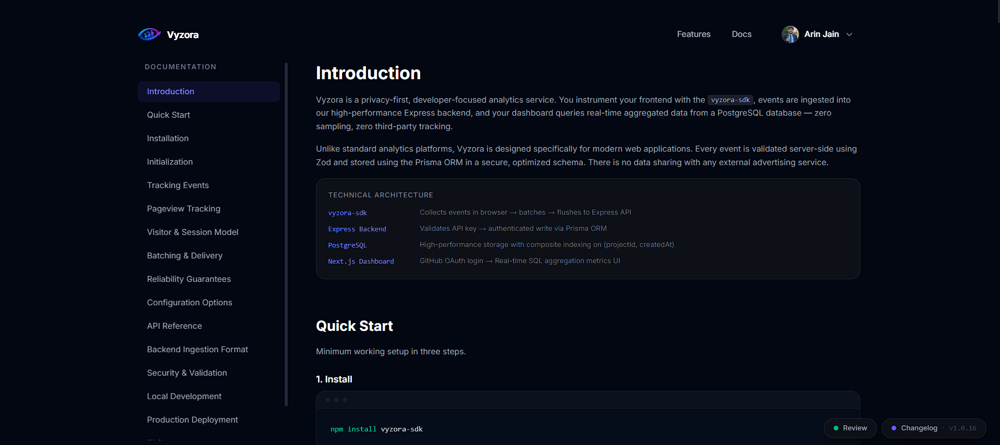
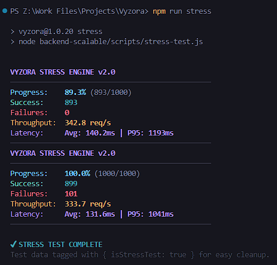
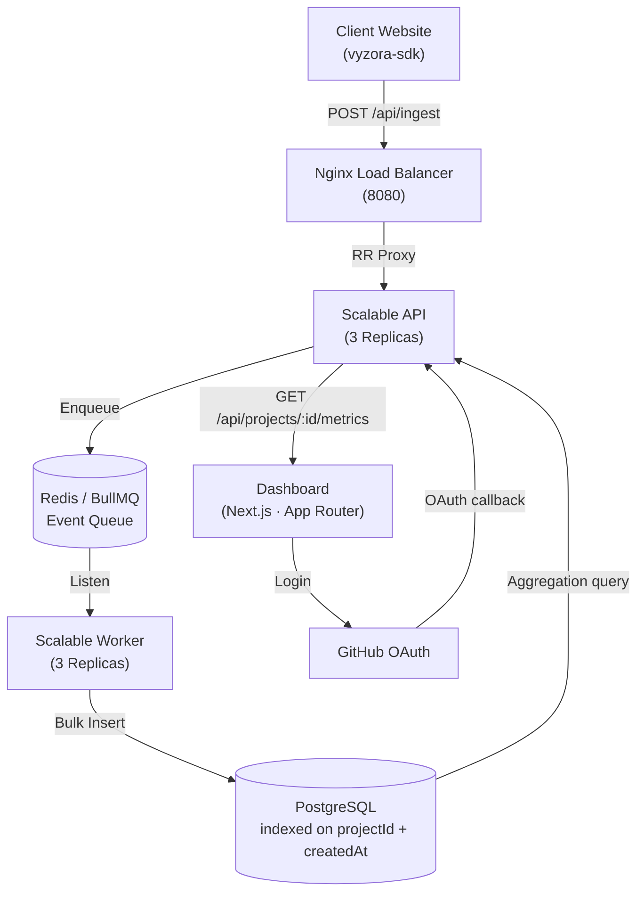
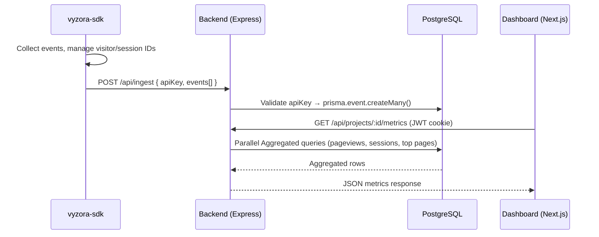

# Vyzora

> Privacy-first, developer-focused analytics service. Track events, reconstruct sessions, and query aggregated metrics — without compromising user privacy.

[](CHANGELOG.md)
[](LICENSE)
[](backend/package.json)
[](backend-scalable/api/package.json)
[](runtime-sdk/package.json)
[](https://www.npmjs.com/package/vyzora-sdk)
[](frontend/package.json)

---

Vyzora is a high-performance analytics platform designed for modern web applications. It provides a lightweight tracking foundation coupled with a horizontally scalable ingestion engine.

1. **[`vyzora-sdk`](./runtime-sdk)**: A lightweight TypeScript browser SDK (`< 3 KB` gzipped). It auto-collects pageviews, tracks SPA navigation, and batches events using a resilient `sendBeacon` + `fetch` (keepalive) transport layer.
2. **Scalable Ingestion Engine**: A horizontally scalable, asynchronous backend built on **Express 5, Redis, and BullMQ**. It decouples event reception from database writes, ensuring sub-millisecond API responsiveness even under massive traffic spikes.
3. **Developer Dashboard**: A powerful **Next.js 16** interface. Log in with GitHub, create projects, and immediately see pageviews, session counts, top pages, and daily trend charts with live sparklines and parallel-executed analytics.

No third-party trackers. No data sampling. No invasive cookies. You own the relationship with your users' data.

---

## Visual Preview

### 🏠 Modern Landing Page


### 🖥️ Professional Dashboard


### 📚 Integrated Documentation


### 🚀 High-Performance Stress Testing


---

## Architecture



---

## Data Flow



---

## Tech Stack

| Layer | Technology |
|---|---|
| **Runtime SDK** | TypeScript, tsup (ESM + CJS), sendBeacon + fetch transport |
| **Scalable API** | Node.js 20, Express 5, BullMQ (Producer), IORedis |
| **Scalable Worker** | Node.js 20, BullMQ (Consumer), Bulk Insertion Engine |
| **Infrastructure** | Nginx (Keepalive Tuning), Redis, Docker Compose |
| **Database** | PostgreSQL ≥ 15 (Supabase Transaction Mode), Prisma 7 |
| **Frontend** | Next.js 16 (App Router), Tailwind CSS v4, Zustand, React Query |
| **Auth** | GitHub OAuth (Passport.js) for dashboard, project-scoped API keys for ingest |
| **Rate Limiting** | `express-rate-limit` with per-route policies |

---

## SDK Highlights

The `vyzora-sdk` is designed to be zero-overhead and production-safe:

- **Auto pageviews**: fires on `window.load`, `pushState`, `replaceState`, and `popstate` — full SPA support.
- **Auto-Metadata**: Automatically captures Browser/OS, Device Type, Screen Dimensions, Language, Referrer, and Timezone (IANA).
- **Visitor identity**: stable UUID stored in `localStorage` (`vyzora_vid`), never rotates, in-memory fallback for private browsing.
- **Session identity**: UUID (`vyzora_sid`) with 30-minute inactivity expiry, refreshed on every event.
- **Atomic Flushing**: Uses `splice(0, length)` logic to clear the event queue atomically, ensuring zero event loss during heavy navigation.
- **Concurrency Guard**: Implements a `flushing` lock flag to prevent redundant network requests during simultaneous `visibilitychange` and `pagehide` signals.
- **Batching**: in-memory queue, flushes every 10 seconds, on batch overflow (20 events), on `visibilitychange`, and on `pagehide`.
- **Transport**: `navigator.sendBeacon` first, `fetch` with `keepalive: true` as fallback, single retry on 5xx/network errors, silent drop on 4xx.
- **Safety**: all `localStorage` access wrapped in `try/catch`, SDK never throws, no-ops in SSR (`window === undefined`).

---

## Scalable Ingestion Highlights

- **Asynchronous Ingestion** (`POST /api/ingest`): The API gateway enqueues events to Redis in milliseconds. Jobs are processed in the background by specialized workers, protecting the API from database-induced latency.
- **LRU In-Memory Caching**: API keys (5m TTL) and Project Ownership (5s TTL) are cached at the gateway layer to eliminate redundant database roundtrips.
- **Bulk Database Writing**: Workers utilize a dedicated ingestion engine that performs bulk inserts via `prisma.event.createMany({ skipDuplicates: true })`.
- **Database Resilience**: Configured for **Supabase Transaction Mode (Port 6543)** with explicit connection pooling limits, allowing dozens of concurrent workers to handle millions of events without connection overflows.
- **Monitoring**: API gateway generates warning logs if Redis queue depth exceeds 1000 items, allowing for proactive scaling.
- **Horizontal Scaling**: Fully containerized architecture allows you to scale up by simply adding replicas (`--scale api=3 --scale worker=3`).
- **Nginx Optimization**: Tuned with **Upstream Keepalive pooling** (32 connections) and a 2MB client body limit for optimal ingestion performance.
- **Analytics Performance**: Aggregated metrics are calculated concurrently via `Promise.all` and optimized using `timestamptz` timezone casting in PostgreSQL.

---

## Monorepo Structure

```
vyzora/
├── backend-scalable/         # NEW Scalable Architecture (Recommended)
│   ├── api/                  # API Service (Producer + LRU Caching)
│   ├── worker/               # Worker Service (Consumer + Bulk Ingestion)
│   ├── nginx/                # Load Balancer (Keepalive + Body Config)
│   └── scripts/              # Stress testing & maintenance
├── backend/                  # Legacy Monolithic API
│   ├── src/
│   │   ├── controllers/      # auth, ingest, project, metrics
│   │   ├── routes/           # route definitions
│   │   ├── middleware/        # JWT auth, rate limiter
│   │   ├── services/          # business logic
│   │   └── index.ts           # entry point + CORS + session
│   ├── prisma/
│   │   └── schema.prisma      # User, Project, Event models
│   └── .env.example
│
├── frontend/                 # Next.js 16 dashboard + marketing site
│   ├── app/
│   │   ├── page.tsx           # Homepage (marketing)
│   │   ├── docs/              # SDK documentation (17 sections)
│   │   ├── login/             # GitHub OAuth entry
│   │   └── dashboard/         # Project dashboard (metrics, charts)
│   ├── components/
│   │   ├── Navbar.tsx
│   │   ├── ChangelogButton.tsx
│   │   ├── DocsSidebar.tsx
│   │   └── dashboard/         # MetricCard, EventTable, TrendChart, etc.
│   └── data/
│       └── versions.json      # Changelog modal data
│
├── runtime-sdk/              # vyzora-sdk npm package (Atomic In-Memory Queue)
│   ├── src/
│   │   ├── core.ts            # Vyzora class, constructor, track, pageview
│   │   ├── queue.ts           # In-memory event queue + flush logic
│   │   ├── transport.ts       # sendBeacon + fetch + retry
│   │   ├── visitor.ts         # Visitor ID (vyzora_vid)
│   │   ├── session.ts         # Session ID (vyzora_sid) + rotation
│   │   ├── storage.ts         # Safe localStorage wrappers
│   │   └── metadata.ts        # Auto browser metadata collection
│   └── tsup.config.ts
│
├── package.json              # Workspace root (npm workspaces)
├── README.md
└── CHANGELOG.md
```

---

## Local Development

### Prerequisites

- Node.js ≥ 20
- PostgreSQL ≥ 15
- npm ≥ 10

### 1. Clone

```bash
git clone https://github.com/your-org/vyzora.git
cd vyzora
npm install
```

### 2. Launch Scalable Stack (Default)

The scalable stack uses Docker Compose to orchestrate API replicas, workers, Nginx, and Redis.

```bash
# From the project root
npm run dev:scalable
```

This command will:
1. Spin up **3 API replicas** and **3 Worker replicas**.
2. Launch the **Nginx** Load Balancer at `http://localhost:8080`.
3. Start the **Redis** message bus.
4. Launch the **Next.js Dashboard** at `http://localhost:3000`.

### 3. Verification & CI

```bash
npm run verify           # Full pre-flight check: Lint + Security + Build
npm run security-audit   # Scan monorepo for high-level package vulnerabilities
npm run test             # Run unified backend Vitest suites
npm run stress           # Simulate high-concurrency ingestion batches
```

### 4. SDK (for development)

```bash
cd runtime-sdk
cp .env.example .env
# VYZORA_API_URL=http://localhost:4000/api/ingest
npm run dev   # tsup watch mode
```

---

## Environment Variables

Configuration is managed via a single `.env` file at the project root for the scalable architecture (API, Worker, Nginx). Local services like the legacy backend or SDK dev-environment may use their own local `.env` files.

### Project Root (`.env`) / Scalable Stack

| Variable | Description |
|---|---|
| `DATABASE_URL` | PostgreSQL connection string |
| `REDIS_HOST` | Redis host (default: `localhost` or `redis` in Docker) |
| `JWT_SECRET` | Secret for signing JWT tokens (Required in production) |
| `FRONTEND_URL` | Allowed CORS origin (e.g. `https://your-app.vercel.app`) |
| `BACKEND_URL` | Public backend gateway URL (used for OAuth callbacks) |
| `GITHUB_CLIENT_ID` | GitHub OAuth app client ID |
| `GITHUB_CLIENT_SECRET` | GitHub OAuth app client secret |

---

## Database Migration Strategy

Vyzora leverages **Prisma Migrations** to manage schema evolution with high confidence:

- **Development Workflow**: Use `npx prisma migrate dev` to generate and apply incremental SQL migrations. This keeps the local database in sync and updates the Prisma Client types.
- **Production Deployment**: The `npx prisma migrate deploy` command is used in CI/CD pipelines to apply pending migrations safely to the production instance (e.g., Supabase) before the new application version goes live.
- **Schema Safety**: The monorepo ensures that the same schema is shared between the legacy backend and the scalable worker, preventing drift during bulk insertion.

---

## Error Handling & Validation

The API uses a standardized response format for all error states, ensuring predictable behavior for SDKs and dashboard integrations.

### Validation Errors (400)
Powered by **Zod**, the API returns field-level error messages:
```json
{
  "success": false,
  "errors": {
    "apiKey": ["String must contain exactly 64 character(s)"],
    "events": ["Array must contain at most 500 element(s)"]
  }
}
```

### Internal Failures (500)
In production, detailed stack traces are suppressed to prevent info leaks:
```json
{
  "success": false,
  "message": "Internal server error"
}
```

---

## Session Reconstruction Logic

Vyzora reconstructs user sessions dynamically at the query layer rather than during ingestion. This "lazy reconstruction" ensures the ingestion pipeline remains extremely fast.

- **Grouping**: Events are grouped by `sessionId` and `visitorId`.
- **Metrics Calculation**:
  - **Start/End Times**: Derived from `MIN(createdAt)` and `MAX(createdAt)` for a given `sessionId`.
  - **Activity Depth**: Calculated by `COUNT(*)` per session.
  - **Bounce Rate**: Identified by sessions with exactly one `pageview` event.
- **Inactivity Threshold**: The SDK automatically rotates the `sessionId` after 30 minutes of inactivity, effectively "closing" the session for the next ingestion batch.

---

## Performance & Benchmarking

The "sub-millisecond API responsiveness" claim is made possible by the **Producer-Consumer architecture**.

1. **Producer (API)**: When a `POST /api/ingest` request arrives, the API validates the key and enqueues the payload to **Redis**. Redis `LPUSH` operations typically complete in **< 0.5ms**.
2. **Consumer (Worker)**: Background workers pick up batches and perform bulk database writes using `createMany`.

### Stress Test Results
The included `npm run stress` script simulates high-concurrency event bursts. 

**Standard Benchmark Environment:**
- **Specs**: Local Development Machine (Windows 11 / 16GB+ RAM / NVMe SSD)
- **Service**: 3x API replicas, 1x Redis instance, 1x Nginx balancer

**Gateway Ingestion Result:**
```text
VYZORA STRESS ENGINE v2.0
────────────────────────────────────────────────
Progress:    100.0% (1000/1000)
Success:     899
Failures:    101
Throughput:  333.7 req/s
Latency:     Avg: 131.6ms | P95: 1041ms
────────────────────────────────────────────────
```

> [!TIP]
> **Rate-Limiting in Action**: The 101 failures observed above are **intentional**. The Vyzora scalable architecture (3x API replicas) correctly enforced a 300 req/min/instance threshold, protecting the infrastructure from the 1,000-request burst.

> [!NOTE]
> **Performance Disclaimer**: The throughput above measures the **API Gateway's ability to enqueue events to Redis**. In production, actual end-to-end performance will be influenced by network latency, database IOPS (PostgreSQL), and the consumption rate of background workers.

---

## SDK Footprint & Build

The `vyzora-sdk` is optimized for zero-impact on your site's performance.

- **Bundle Size**: `< 3 KB` (gzipped).
- **No Dependencies**: 100% vanilla TypeScript.
- **Verification**: You can verify the bundle size by running:
  ```bash
  cd runtime-sdk
  npm run build
  gzip -c dist/index.js | wc -c   # Should report ~2.4-2.8 KB
  ```

---

## Privacy & Security

Vyzora is built from the ground up to be the most private way to track web analytics.

- **Data Integrity**: All API keys are secured using deterministic **SHA-256 hashing**. Original keys are never stored in plain text.
- **Ingest Safeguards**: Strict **500-event request caps** and **scalar-only metadata sanitization** to prevent floods and prototype pollution.
- **Auth Resilience**: GitHub OAuth flow protected by **random state verification** and logout endpoints secured against CSRF via origin/referer validation.
- **No Third-Party Cookies**: Vyzora uses standard first-party identification.
- **GDPR Ready**: We don't track PII by default. Identifiers (Visitor/Session IDs) are anonymous UUIDs.
- **Secure Auth**: Dashboard access is protected by GitHub OAuth and secure JWT-based sessions.

---

## SDK Usage

```bash
npm install vyzora-sdk
```

```typescript
import { Vyzora } from 'vyzora-sdk';

const vyzora = new Vyzora({
  apiKey: 'your_project_api_key',  // from dashboard
  enabled: true,
});

// Track a custom event
vyzora.track('upgrade_clicked', { plan: 'pro' });

// Identify a known user
vyzora.identify('user_db_id_123');

// Manual flush (e.g. before logout)
await vyzora.flush();
```

Pageviews are tracked automatically on load and every SPA navigation. No additional setup needed.

---

## Changelog

See [CHANGELOG.md](CHANGELOG.md) for the full version history.

---

## License

[MIT](LICENSE)


