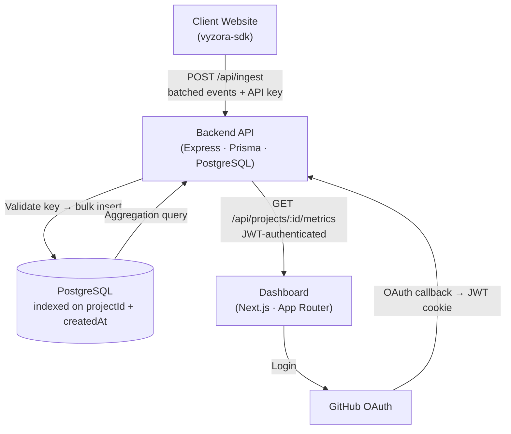
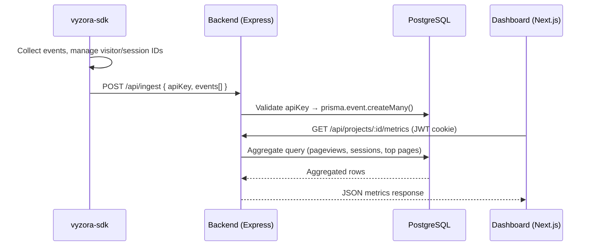

# Vyzora

> Self-hosted, open-source analytics for developers. Track events, reconstruct sessions, and query aggregated metrics — without sending data to a third party.

[](CHANGELOG.md)
[](LICENSE)
[](backend/package.json)
[](runtime-sdk/package.json)
[](frontend/package.json)

---

## What is Vyzora?

Vyzora is a full-stack analytics platform you run on your own infrastructure. It consists of three parts that work together:

1. **[`vyzora-sdk`](./runtime-sdk)** — A lightweight TypeScript browser SDK (`< 3 KB` gzipped). Drop it into any JavaScript or TypeScript project. It auto-collects pageviews, tracks your SPA navigation, manages visitor and session identity, and batches events before sending them to your backend.

2. **[Backend API](./backend)** — An Express + TypeScript REST API that receives batched event payloads, validates them against project-scoped API keys, and bulk-inserts them into PostgreSQL using Prisma. Also serves aggregated metrics to the dashboard.

3. **[Dashboard](./frontend)** — A Next.js 16 App Router frontend. Log in with GitHub OAuth, create projects, copy your API key, and immediately see pageviews, session counts, top pages, custom events, and daily trend charts for each project.

No third-party analytics services. No data sampling. No SaaS subscription. You own everything.

---

## Architecture



---

## Data Flow



---

## Tech Stack

| Layer | Technology |
|---|---|
| **Runtime SDK** | TypeScript, tsup (ESM + CJS dual build), sendBeacon + fetch transport |
| **Backend** | Node.js 18+, Express 5, TypeScript, Prisma 6, Zod, Passport.js, JWT |
| **Database** | PostgreSQL ≥ 15, indexed on `(projectId, createdAt)` |
| **Frontend** | Next.js 16 (App Router), TypeScript, Tailwind CSS v4, Zustand, React Query |
| **Auth** | GitHub OAuth (Passport.js) for dashboard, project-scoped API keys for ingest |
| **Rate Limiting** | `express-rate-limit` with per-route policies |

---

## SDK Highlights

The `vyzora-sdk` is designed to be zero-overhead and production-safe:

- **Auto pageviews**: fires on `window.load`, `pushState`, `replaceState`, and `popstate` — full SPA support
- **Visitor identity**: stable UUID stored in `localStorage` (`vyzora_vid`), never rotates, in-memory fallback for private browsing
- **Session identity**: UUID (`vyzora_sid`) with 30-minute inactivity expiry, refreshed on every event
- **Batching**: in-memory queue, flushes every 10 seconds, on batch overflow (20 events), on `visibilitychange`, and on `pagehide`
- **Transport**: `navigator.sendBeacon` first, `fetch` with `keepalive: true` as fallback, single retry on 5xx/network errors, silent drop on 4xx
- **Safety**: all `localStorage` access wrapped in `try/catch`, SDK never throws, no-ops in SSR (`window === undefined`)

---

## Backend Highlights

- **Ingest endpoint** (`POST /api/ingest`): validates `X-Api-Key` header against `project.apiKey` in database, runs Zod schema validation on each event, bulk-inserts valid batches via `prisma.event.createMany({ skipDuplicates: true })`
- **Metrics endpoint** (`GET /api/projects/:id/metrics`): verifies project ownership against the JWT claims, runs `COUNT`, `COUNT DISTINCT`, `GROUP BY path`, `GROUP BY eventType`, and `GROUP BY DATE` queries over the `event` table with optional time-range filtering (1d, 7d, 30d, 90d)
- **Auth**: GitHub OAuth issues a signed JWT stored in an HttpOnly, SameSite=None, Secure cookie — works across separate frontend/backend domains
- **Security**: rate limiting on all ingest and auth routes, cascade-delete ensures all events are removed when a project is deleted, API keys are 64-character hex strings generated with `crypto.randomBytes(32)`

---

## Monorepo Structure

```
vyzora/
├── backend/                  # Express API
│   ├── src/
│   │   ├── controllers/      # auth, ingest, project, metrics
│   │   ├── routes/           # route definitions
│   │   ├── middleware/        # JWT auth, rate limiter
│   │   ├── services/          # business logic
│   │   └── index.ts           # entry point + CORS + session
│   ├── prisma/
│   │   └── schema.prisma      # User, Project, Event models
│   └── .env.example
│
├── frontend/                 # Next.js dashboard + marketing site
│   ├── app/
│   │   ├── page.tsx           # Homepage (marketing)
│   │   ├── docs/              # SDK documentation (17 sections)
│   │   ├── login/             # GitHub OAuth entry
│   │   └── dashboard/         # Project dashboard (metrics, charts)
│   ├── components/
│   │   ├── Navbar.tsx
│   │   ├── ChangelogButton.tsx
│   │   ├── DocsSidebar.tsx
│   │   └── dashboard/         # MetricCard, EventTable, TrendChart, etc.
│   └── data/
│       └── versions.json      # Changelog modal data
│
├── runtime-sdk/              # vyzora-sdk npm package
│   ├── src/
│   │   ├── core.ts            # Vyzora class, constructor, track, pageview
│   │   ├── queue.ts           # In-memory event queue + flush logic
│   │   ├── transport.ts       # sendBeacon + fetch + retry
│   │   ├── visitor.ts         # Visitor ID (vyzora_vid)
│   │   ├── session.ts         # Session ID (vyzora_sid) + rotation
│   │   ├── storage.ts         # Safe localStorage wrappers
│   │   └── metadata.ts        # Auto browser metadata collection
│   └── tsup.config.ts
│
├── package.json              # Workspace root (npm workspaces)
├── README.md
└── CHANGELOG.md
```

---

## Local Development

### Prerequisites

- Node.js ≥ 18
- PostgreSQL ≥ 15
- npm ≥ 9

### 1. Clone

```bash
git clone https://github.com/your-org/vyzora.git
cd vyzora
npm install
```

### 2. Backend

```bash
cp backend/.env.example backend/.env
# Fill in: DATABASE_URL, SESSION_SECRET, GITHUB_CLIENT_ID, GITHUB_CLIENT_SECRET, JWT_SECRET, FRONTEND_URL
cd backend
npx prisma db push
npm run dev
# → http://localhost:4000
```

### 3. Frontend

```bash
cp frontend/.env.example frontend/.env.local
# Fill in: NEXT_PUBLIC_API_URL=http://localhost:4000
cd frontend
npm run dev
# → http://localhost:3000
```

### 4. SDK (for development)

```bash
cd runtime-sdk
cp .env.example .env
# VYZORA_API_URL=http://localhost:4000/api/ingest
npm run dev   # tsup watch mode
```

### 5. Run all at once (dev)

```bash
# From monorepo root:
npm run dev
```

---

## Environment Variables

### Backend (`backend/.env`)

| Variable | Description |
|---|---|
| `DATABASE_URL` | PostgreSQL connection string |
| `SESSION_SECRET` | Express session secret (any long random string) |
| `GITHUB_CLIENT_ID` | GitHub OAuth app client ID |
| `GITHUB_CLIENT_SECRET` | GitHub OAuth app client secret |
| `JWT_SECRET` | Secret for signing JWT tokens |
| `FRONTEND_URL` | Allowed CORS origin (e.g. `https://your-app.vercel.app`) |
| `PORT` | Backend port (default: `4000`) |

### Frontend (`frontend/.env.local`)

| Variable | Description |
|---|---|
| `NEXT_PUBLIC_API_URL` | Backend API base URL (e.g. `http://localhost:4000`) |

### SDK (`runtime-sdk/.env`)

| Variable | Description |
|---|---|
| `VYZORA_API_URL` | Ingest endpoint (e.g. `http://localhost:4000/api/ingest`) |

---

## SDK Usage

```bash
npm install vyzora-sdk
```

```typescript
import { Vyzora } from 'vyzora-sdk';

const vyzora = new Vyzora({
  apiKey: 'your_project_api_key',  // from dashboard
  enabled: true,
});

// Track a custom event
vyzora.track('upgrade_clicked', { plan: 'pro' });

// Identify a known user
vyzora.identify('user_db_id_123');

// Manual flush (e.g. before logout)
await vyzora.flush();
```

Pageviews are tracked automatically on load and every SPA navigation. No additional setup needed.

---

## Changelog

See [CHANGELOG.md](CHANGELOG.md) for the full version history.

---

## License

[MIT](LICENSE)