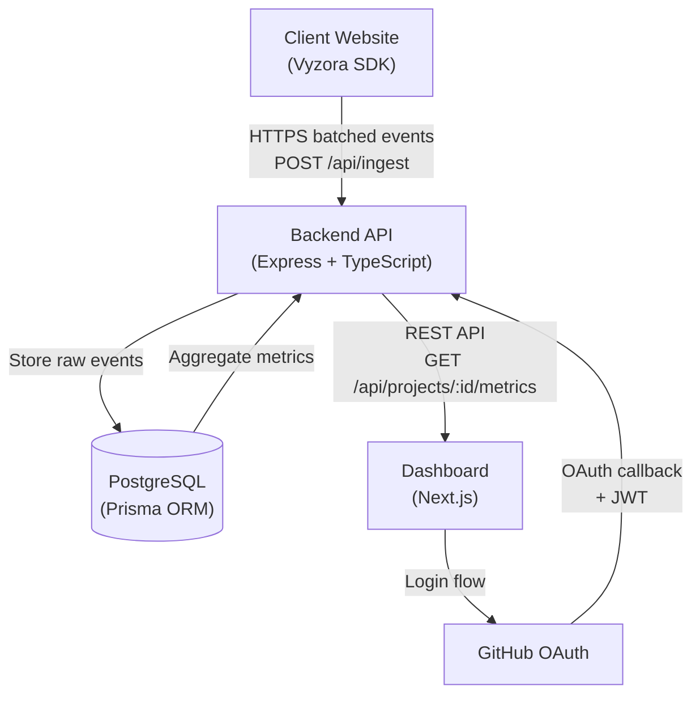
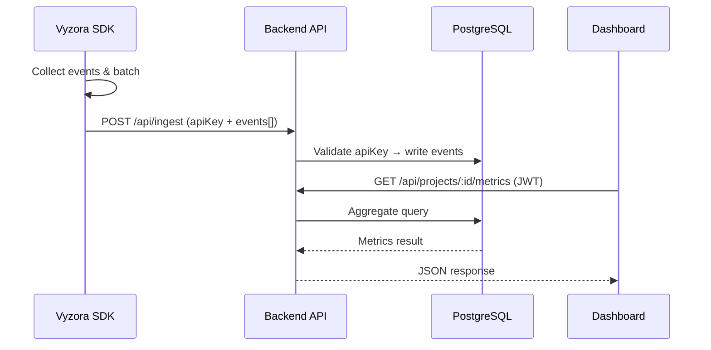

# Vyzora

> Modern analytics SaaS platform for developers and founders — track events, analyze sessions, and visualize your product metrics.

[](CHANGELOG.md)
[](LICENSE)

---

## Project Overview

Vyzora provides website event tracking, session analytics, and dashboard visualization. It is built as a multi-tenant SaaS platform, allowing developers to instrument their apps with a lightweight SDK and view aggregated metrics on a clean dashboard.

---

## Tech Stack

| Layer         | Technology                                                     |
|---------------|----------------------------------------------------------------|
| Backend       | Node.js, Express, TypeScript, Prisma, PostgreSQL, JWT, Passport |
| Frontend      | Next.js 15 (App Router), TypeScript, TailwindCSS, Zustand, React Query |
| SDK           | TypeScript, tsup (ESM + CJS build)                             |
| Auth          | GitHub OAuth via Passport.js + JWT session tokens              |
| Database      | PostgreSQL (via Prisma ORM)                                    |

---

## Architecture



---

## Data Flow



---

## Folder Structure

```
vyzora/
├── backend/                  # Express API + Prisma ORM
│   ├── src/
│   │   ├── routes/
│   │   ├── controllers/
│   │   ├── middleware/
│   │   ├── services/
│   │   ├── config/
│   │   └── index.ts
│   ├── prisma/
│   │   └── schema.prisma
│   └── .env.example
│
├── frontend/                 # Next.js dashboard
│   ├── app/
│   │   ├── layout.tsx
│   │   ├── page.tsx
│   │   ├── dashboard/
│   │   └── login/
│   ├── components/
│   ├── lib/
│   └── styles/
│
├── runtime-sdk/              # Client-side analytics SDK
│   ├── src/
│   │   ├── index.ts
│   │   ├── tracker.ts
│   │   ├── session.ts
│   │   └── batch.ts
│   └── tsup.config.ts
│
├── docs/
│   ├── architecture.md
│   ├── sdk-design.md
│   └── api-spec.md
│
├── README.md
└── CHANGELOG.md
```

---

## Setup Instructions

### Prerequisites

- Node.js ≥ 18
- PostgreSQL ≥ 15
- npm ≥ 9

### 1. Clone

```bash
git clone https://github.com/your-org/vyzora.git
cd vyzora
```

### 2. Backend

```bash
cd backend
cp .env.example .env
npm install
npx prisma db push
npm run dev
```

### 3. Frontend

```bash
cd ../frontend
npm install
npm run dev
```

### 4. Runtime SDK

```bash
cd ../runtime-sdk
npm install
npm run build
```