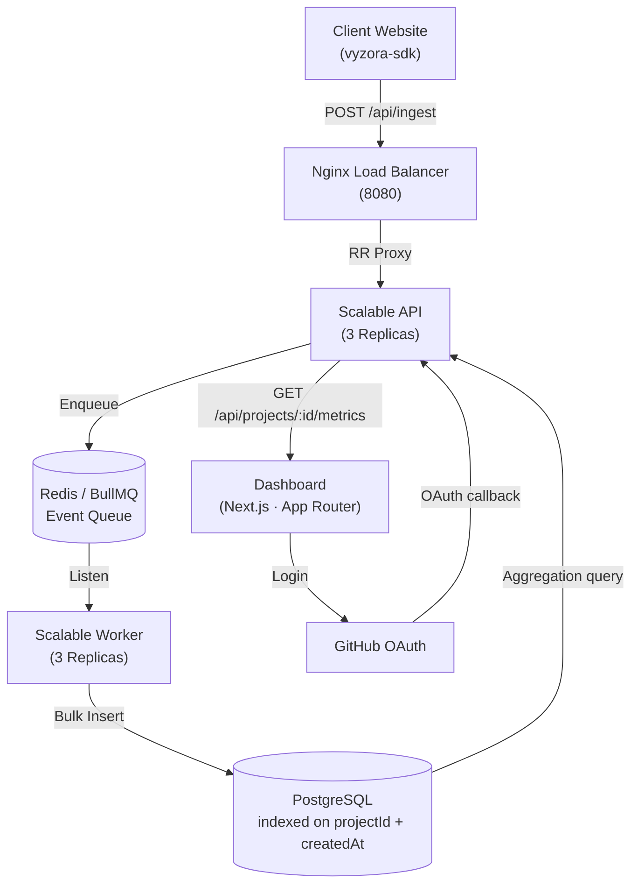
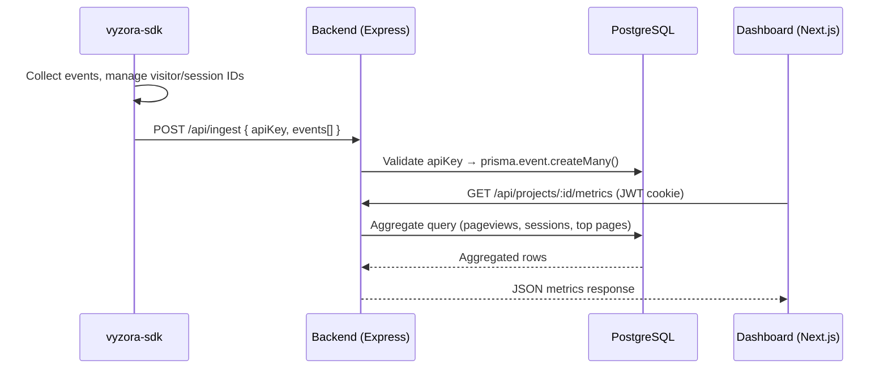

# Vyzora

> Privacy-first, developer-focused analytics service. Track events, reconstruct sessions, and query aggregated metrics — without compromising user privacy.

[](CHANGELOG.md)
[](LICENSE)
[](backend/package.json)
[](backend-scalable/api/package.json)
[](runtime-sdk/package.json)
[](frontend/package.json)

---

Vyzora is a high-performance analytics service designed for modern developers. It provides:

1. **[`vyzora-sdk`](./runtime-sdk)** — A lightweight TypeScript browser SDK (`< 3 KB` gzipped). Drop it into any JavaScript or TypeScript project. It auto-collects pageviews, tracks SPA navigation, and batches events before sending them to the scalable gateway.

2. **Scalable Ingestion Engine** — A horizontally scalable, asynchronous backend built on **Express, Redis, and BullMQ**. It decouples event reception from database writes, ensuring sub-millisecond API responsiveness even under massive traffic spikes.

3. **Developer Dashboard** — A powerful Next.js interface. Log in with GitHub, create projects, and immediately see pageviews, session counts, top pages, and daily trend charts.

No third-party trackers. No data sampling. No invasive cookies. You own the relationship with your users' data.

---

## Architecture



---

## Data Flow



---

## Tech Stack

| Layer | Technology |
|---|---|
| **Runtime SDK** | TypeScript, tsup (ESM + CJS), sendBeacon + fetch transport |
| **Scalable API** | Node.js 20, Express 5, BullMQ (Producer), IORedis |
| **Scalable Worker** | Node.js 20, BullMQ (Consumer), Bulk Insertion Engine |
| **Infrastructure** | Nginx (Load Balancer), Redis, Docker Compose |
| **Database** | PostgreSQL ≥ 15 (Supabase Transaction Mode), Prisma 7 |
| **Frontend** | Next.js 16 (App Router), Tailwind CSS v4, Zustand, React Query |
| **Auth** | GitHub OAuth (Passport.js) for dashboard, project-scoped API keys for ingest |
| **Rate Limiting** | `express-rate-limit` with per-route policies |

---

## SDK Highlights

The `vyzora-sdk` is designed to be zero-overhead and production-safe:

- **Auto pageviews**: fires on `window.load`, `pushState`, `replaceState`, and `popstate` — full SPA support
- **Visitor identity**: stable UUID stored in `localStorage` (`vyzora_vid`), never rotates, in-memory fallback for private browsing
- **Session identity**: UUID (`vyzora_sid`) with 30-minute inactivity expiry, refreshed on every event
- **Batching**: in-memory queue, flushes every 10 seconds, on batch overflow (20 events), on `visibilitychange`, and on `pagehide`
- **Transport**: `navigator.sendBeacon` first, `fetch` with `keepalive: true` as fallback, single retry on 5xx/network errors, silent drop on 4xx
- **Safety**: all `localStorage` access wrapped in `try/catch`, SDK never throws, no-ops in SSR (`window === undefined`)

---

## Scalable Ingestion Highlights

- **Asynchronous Ingestion** (`POST /api/ingest`): The API gateway enqueues events to Redis in milliseconds. Jobs are processed in the background by specialized workers, protecting the API from database-induced latency.
- **Bulk Database Writing**: Workers utilize a dedicated ingestion engine that performs bulk inserts via `prisma.event.createMany({ skipDuplicates: true })`.
- **Database Resilience**: Configured for **Supabase Transaction Mode (Port 6543)** with explicit connection pooling limits, allowing dozens of concurrent workers to handle millions of events without connection overflows.
- **Horizontal Scaling**: Fully containerized architecture allows you to scale up by simply adding replicas (`--scale api=3 --scale worker=3`).
- **Nginx Load Balancer**: Distributes traffic across healthy API replicas and handles automatic failover.
- **Metrics APIs**: Aggregated metrics are calculated in real-time using optimized indices on `(projectId, createdAt)`.

---

## Monorepo Structure

```
vyzora/
├── backend-scalable/         # NEW Scalable Architecture (Recommended)
│   ├── api/                  # API Service (Producer)
│   ├── worker/               # Worker Service (Consumer)
│   ├── nginx/                # Load Balancer config
│   └── scripts/              # Stress testing & maintenance
├── backend/                  # Legacy Monolithic API
│   ├── src/
│   │   ├── controllers/      # auth, ingest, project, metrics
│   │   ├── routes/           # route definitions
│   │   ├── middleware/        # JWT auth, rate limiter
│   │   ├── services/          # business logic
│   │   └── index.ts           # entry point + CORS + session
│   ├── prisma/
│   │   └── schema.prisma      # User, Project, Event models
│   └── .env.example
│
├── frontend/                 # Next.js dashboard + marketing site
│   ├── app/
│   │   ├── page.tsx           # Homepage (marketing)
│   │   ├── docs/              # SDK documentation (17 sections)
│   │   ├── login/             # GitHub OAuth entry
│   │   └── dashboard/         # Project dashboard (metrics, charts)
│   ├── components/
│   │   ├── Navbar.tsx
│   │   ├── ChangelogButton.tsx
│   │   ├── DocsSidebar.tsx
│   │   └── dashboard/         # MetricCard, EventTable, TrendChart, etc.
│   └── data/
│       └── versions.json      # Changelog modal data
│
├── runtime-sdk/              # vyzora-sdk npm package
│   ├── src/
│   │   ├── core.ts            # Vyzora class, constructor, track, pageview
│   │   ├── queue.ts           # In-memory event queue + flush logic
│   │   ├── transport.ts       # sendBeacon + fetch + retry
│   │   ├── visitor.ts         # Visitor ID (vyzora_vid)
│   │   ├── session.ts         # Session ID (vyzora_sid) + rotation
│   │   ├── storage.ts         # Safe localStorage wrappers
│   │   └── metadata.ts        # Auto browser metadata collection
│   └── tsup.config.ts
│
├── package.json              # Workspace root (npm workspaces)
├── README.md
└── CHANGELOG.md
```

---

---

## Local Development

### Prerequisites

- Node.js ≥ 18
- PostgreSQL ≥ 15
- npm ≥ 9

### 1. Clone

```bash
git clone https://github.com/your-org/vyzora.git
cd vyzora
npm install
```

### 2. Launch Scalable Stack (Default)

The scalable stack uses Docker Compose to orchestrate API replicas, workers, Nginx, and Redis.

```bash
# From the project root
npm run dev:scalable
```

This command will:
1. Spin up **3 API replicas** and **3 Worker replicas**.
2. Launch the **Nginx** Load Balancer at `http://localhost:8080`.
3. Start the **Redis** message bus.
4. Launch the **Next.js Dashboard** at `http://localhost:3000`.

### 3. Stress Test (Verification)

Confirm the system can handle concurrent ingestion:

```bash
npm run stress
```

### 4. SDK (for development)

```bash
cd runtime-sdk
cp .env.example .env
# VYZORA_API_URL=http://localhost:4000/api/ingest
npm run dev   # tsup watch mode
```

---

## Environment Variables

Configuration is managed via a single `.env` file at the project root for the scalable architecture (API, Worker, Nginx). Local services like the legacy backend or SDK dev-environment may use their own local `.env` files.

### Project Root (`.env`) / Scalable Stack

| Variable | Description |
|---|---|
| `DATABASE_URL` | PostgreSQL connection string |
| `REDIS_HOST` | Redis host (default: `localhost` or `redis` in Docker) |
| `JWT_SECRET` | Secret for signing JWT tokens (Required in production) |
| `FRONTEND_URL` | Allowed CORS origin (e.g. `https://your-app.vercel.app`) |
| `BACKEND_URL` | Public backend gateway URL (used for OAuth callbacks) |
| `GITHUB_CLIENT_ID` | GitHub OAuth app client ID |
| `GITHUB_CLIENT_SECRET` | GitHub OAuth app client secret |

### Legacy Backend (`backend/.env`)

---

## Privacy & Security

Vyzora is built from the ground up to be the most private way to track web analytics.

- **No Third-Party Cookies**: Vyzora uses standard first-party identification.
- **GDPR Ready**: We don't track PII by default. Identifiers (Visitor/Session IDs) are anonymous UUIDs.
- **Data Integrity**: Our ingest API uses 64-character cryptographic API keys to ensure only your data reaches your dashboard.
- **Secure Auth**: Dashboard access is protected by GitHub OAuth and secure JWT-based sessions.

---

## SDK Usage

```bash
npm install vyzora-sdk
```

```typescript
import { Vyzora } from 'vyzora-sdk';

const vyzora = new Vyzora({
  apiKey: 'your_project_api_key',  // from dashboard
  enabled: true,
});

// Track a custom event
vyzora.track('upgrade_clicked', { plan: 'pro' });

// Identify a known user
vyzora.identify('user_db_id_123');

// Manual flush (e.g. before logout)
await vyzora.flush();
```

Pageviews are tracked automatically on load and every SPA navigation. No additional setup needed.

---

## Changelog

See [CHANGELOG.md](CHANGELOG.md) for the full version history.

---

## License

[MIT](LICENSE)