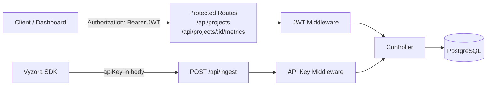

# Vyzora API Specification

## Base URL

```
Production: https://api.vyzora.io
Local Dev:  http://localhost:3001
```

All responses follow the shape:

```json
{
  "success": true,
  "data": {},
  "message": "Human-readable message on errors"
}
```

---

## Request Flow



---

## Auth Endpoints

### `GET /auth/github`

Initiates GitHub OAuth. Browser is redirected to GitHub.

**Response** → HTTP 302 to GitHub authorization page.

---

### `GET /auth/github/callback`

GitHub posts the OAuth code here. Backend verifies, upserts user, issues JWT.

**Response** → HTTP 302 to frontend with JWT.

---

### `GET /auth/me`

Returns the currently authenticated user.

**Headers** `Authorization: Bearer <jwt>`

**Response** `200`
```json
{
  "success": true,
  "data": {
    "id": "uuid",
    "name": "Jane Doe",
    "email": "jane@example.com",
    "avatarUrl": "https://avatars.githubusercontent.com/...",
    "createdAt": "2026-01-01T00:00:00Z"
  }
}
```

---

### `POST /auth/logout`

Stateless logout — client discards JWT.

**Response** `200`
```json
{ "success": true, "message": "Logged out" }
```

---

## Project Endpoints

### `GET /api/projects`

Returns all projects owned by the authenticated user.

**Response** `200`
```json
{
  "success": true,
  "data": [
    { "id": "uuid", "name": "My App", "domain": "myapp.com", "createdAt": "2026-01-01T00:00:00Z" }
  ]
}
```

---

### `POST /api/projects`

Creates a new project and returns its generated API key.

**Body**
```json
{ "name": "My App", "domain": "myapp.com" }
```

**Response** `201`
```json
{
  "success": true,
  "data": { "id": "uuid", "name": "My App", "domain": "myapp.com", "apiKey": "vyz_abc123..." }
}
```

---

### `GET /api/projects/:id`

Returns a single project by its UUID.

**Response** `200`
```json
{
  "success": true,
  "data": { "id": "uuid", "name": "My App", "domain": "myapp.com", "createdAt": "2026-01-01T00:00:00Z" }
}
```

---

### `DELETE /api/projects/:id`

Deletes a project and all associated events.

**Response** `200`
```json
{ "success": true, "message": "Project deleted" }
```

---

## Ingestion Endpoint

### `POST /api/ingest`

Receives a batch of events from the SDK. Authenticated by **API key** (not JWT).

**Body**
```json
{
  "apiKey": "vyz_your_project_api_key",
  "events": [
    {
      "type": "page_view",
      "url": "https://myapp.com/pricing",
      "sessionId": "uuid-v4",
      "timestamp": "2026-02-22T10:00:00.000Z",
      "properties": { "referrer": "https://google.com" }
    }
  ]
}
```

**Response** `202`
```json
{ "success": true, "message": "Events accepted", "data": { "accepted": 1 } }
```

**Error** `401`
```json
{ "success": false, "message": "Invalid API key" }
```

---

## Metrics Endpoints

### `GET /api/projects/:id/metrics`

Returns aggregated analytics for a project.

**Query Parameters**

| Param | Type | Default | Values |
|-------|------|---------|--------|
| `range` | string | `7d` | `1d` `7d` `30d` `90d` |

**Response** `200`
```json
{
  "success": true,
  "data": {
    "totalPageViews": 1240,
    "uniqueSessions": 312,
    "topPages": [
      { "url": "/pricing", "views": 400 },
      { "url": "/", "views": 320 }
    ],
    "topEvents": [
      { "type": "button_click", "count": 88 }
    ],
    "dailyTrend": [
      { "date": "2026-02-15", "pageViews": 180, "sessions": 45 }
    ]
  }
}
```

---

## Error Codes

| Code | Meaning |
|------|---------|
| 400 | Bad Request — invalid payload |
| 401 | Unauthorized — missing/invalid token or API key |
| 403 | Forbidden — resource not owned by requester |
| 404 | Not Found |
| 422 | Validation Error (Zod) |
| 500 | Internal Server Error |
