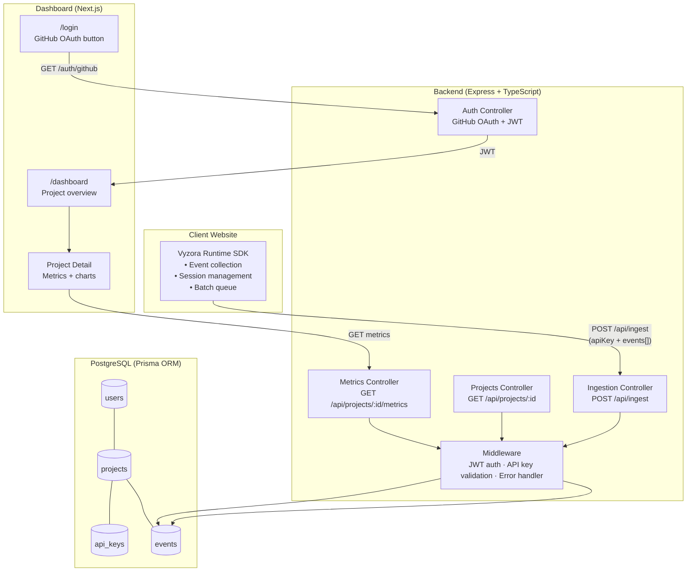
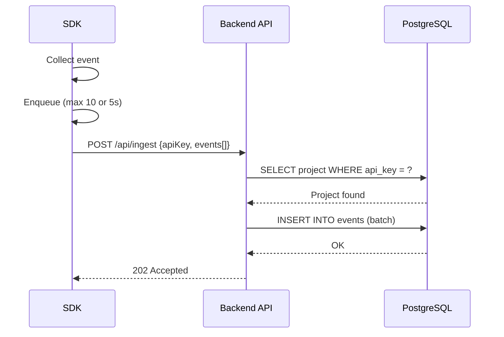
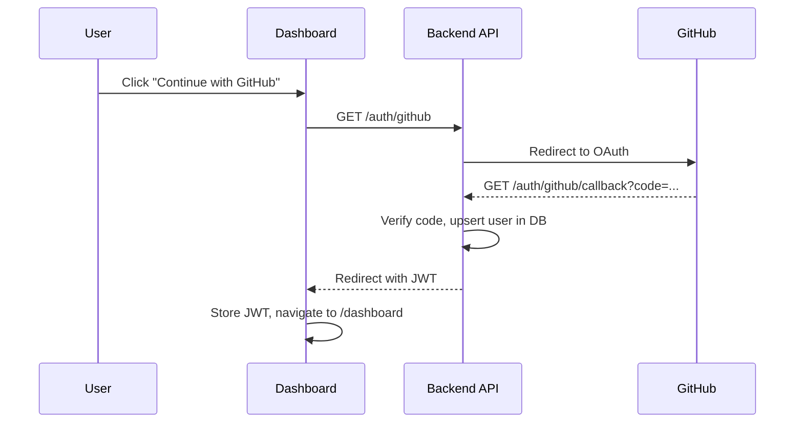
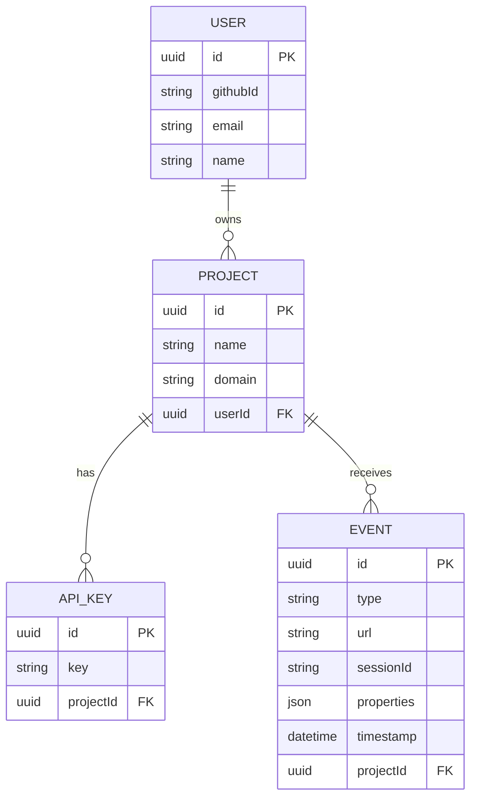

# Vyzora System Architecture

## Overview

Vyzora is a multi-tenant analytics SaaS platform. Developers instrument their apps with the Vyzora SDK, which batches events and sends them to the backend API. Metrics are aggregated and served to the dashboard.

---

## Component Architecture

---

## Data Flow

### Event Ingestion

### Authentication Flow

---

## Multi-Tenant Model

---

## Scalability Notes

| Concern | Strategy |
|---------|----------|
| Stateless backend | JWT auth — horizontally scalable behind a load balancer |
| Ingest throughput | Client-side batching reduces HTTP requests 10× |
| Query performance | Index `events (projectId, timestamp)` for fast metric aggregation |
| Future | Decouple ingestion with BullMQ/Redis message queue |
