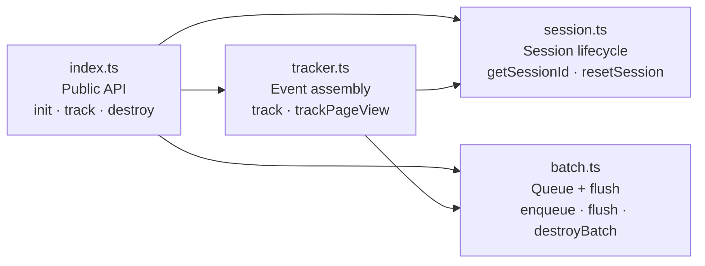
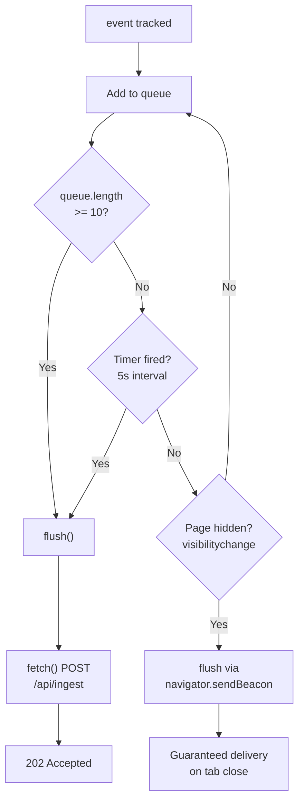
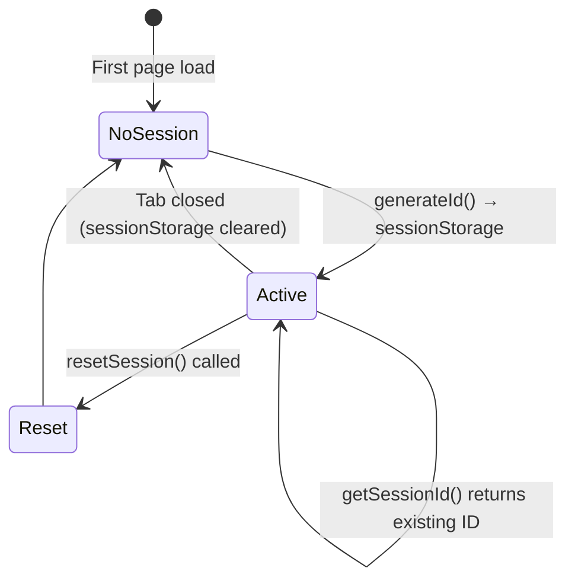
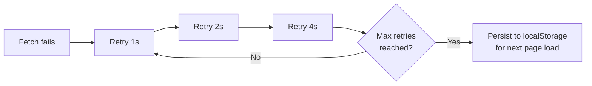

# Vyzora SDK Design

## Overview

The Vyzora SDK is a lightweight, zero-dependency analytics client for the browser. Distributed as an ESM/CJS npm package (`@vyzora/sdk`) and a CDN-hosted IIFE that exposes `window.Vyzora`.

---

## Module Architecture



---

## Batching Strategy



### Flush Triggers

| Trigger | Condition |
|---------|-----------|
| Size-based | Queue reaches 10 events |
| Time-based | Every 5 seconds |
| Page unload | `visibilitychange` → `hidden` |

### Flush Mechanism

- **Normal**: `fetch()` with `keepalive: true`
- **Page unload**: `navigator.sendBeacon()` — guaranteed even when tab closes

---

## Session Lifecycle



- Session ID is a UUIDv4 stored in `sessionStorage`
- Resets automatically when the browser tab closes
- `resetSession()` exposed publicly for post-logout use

---

## Retry Logic (Phase 2)



---

## Fail-Safe Behaviour

| Scenario | Behaviour |
|----------|-----------|
| Called in SSR / Node context | All methods guard `typeof window === 'undefined'` |
| `init()` called twice | No-op with console warning |
| `sendBeacon` unavailable | Falls back to `fetch()` |
| Network offline | Error caught silently (Phase 2: retry queue) |

---

## CDN Usage

```html
<script src="https://cdn.vyzora.io/sdk.js" defer></script>
<script>
  window.addEventListener('load', function () {
    Vyzora.init({ apiKey: 'vyz_your_project_key' });
  });
</script>
```

## npm Usage

```bash
npm install @vyzora/sdk
```

```ts
import { init, track } from '@vyzora/sdk';

init({ apiKey: 'vyz_your_project_key' });
track('button_click', { properties: { buttonId: 'cta-signup' } });
```

---

## Build Output

| Format | File | Use case |
|--------|------|----------|
| ESM | `dist/index.js` | Bundlers (Vite, Next.js) |
| CJS | `dist/index.cjs` | Node.js / `require()` |
| Types | `dist/index.d.ts` | TypeScript consumers |
| IIFE | `dist/sdk.global.js` | CDN `<script>` tag |
